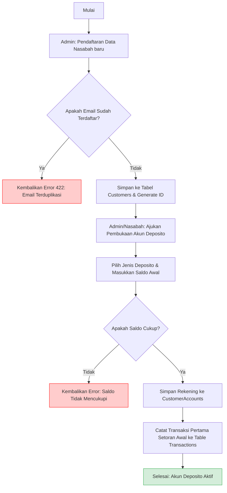
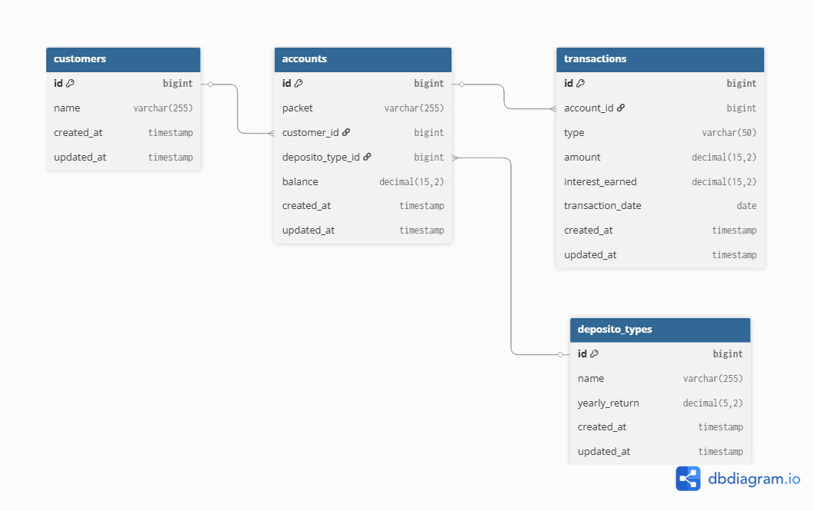
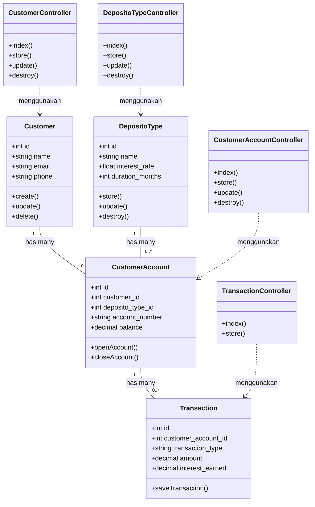

# Dokumentasi Proyek: Bank Saving System

Detail pengerjaan tugas proyek backend dan dokumentasi sistem Bank Deposito.

---

## 1. User & API Flow Diagram

Berikut adalah diagram alir (_Flow Diagram_) yang menggambarkan proses utama di dalam sistem, yaitu alur pendaftaran nasabah hingga pembukaan akun deposito baru:

---

## 2. System Architecture & API Documentation

### a. Database Design

### b. APIs Needed

**0. Modul: Authentication**
| HTTP Method | Endpoint | Nama Request di Postman | Fungsi |
|---|---|---|---|
| `POST` | `/api/login` | Login | Autentikasi masuk nasabah / admin untuk mendapatkan token |
| `POST` | `/api/logout` | Logout | Menghapus token sesi aktif dan keluar sistem |

**1. Folder: Customers**
| HTTP Method | Endpoint | Nama Request di Postman | Fungsi |
|---|---|---|---|
| `POST` | `/api/customers` | Create Customers | Menambahkan data nasabah baru |
| `PUT` | `/api/customers/{id}` | Edit Customers | Mengubah profil data nasabah |
| `DELETE` | `/api/customers/{id}` | Delete Customers | Menghapus data nasabah |
| `GET` | `/api/customers` | Read Customers | Mengambil daftar semua nasabah |

**2. Folder: Depositos**
| HTTP Method | Endpoint | Nama Request di Postman | Fungsi |
|---|---|---|---|
| `POST` | `/api/deposito-types` | Store Deposito Type | Membuat paket bunga deposito baru |
| `GET` | `/api/deposito-types` | Get Deposito | Mengambil daftar jenis paket deposito |
| `PUT` | `/api/deposito-types/{id}` | Edit Deposito | Mengubah data/bunga paket deposito |
| `DELETE` | `/api/deposito-types/{id}` | Delete Deposito Types | Menghapus paket deposito |

**3. Folder: Customers Account & Transactions**
| HTTP Method | Endpoint | Nama Request di Postman | Fungsi |
|---|---|---|---|
| `POST` | `/api/accounts` | Create Customers Account | Membuka rekening kantong deposito baru |
| `PUT` | `/api/accounts/{id}` | Edit Account | Mengubah detail data rekening |
| `DELETE` | `/api/accounts/{id}` | Delete Account | Menutup/menghapus rekening deposito |
| `GET` | `/api/accounts` | Read Accounts | Mengambil daftar rekening nasabah |
| `POST` | `/api/transactions` | Store Transaction | Menginput mutasi tabungan (Setor/Tarik) |

### c. APIs Call Every Screen

1. **Halaman Autentikasi (`Login.vue`)**
    - `POST /api/login` ➡️ Dipicu saat pengguna memasukkan email & password lalu menekan tombol login untuk mendapatkan Bearer Token.

2. **Halaman Kelola Data Nasabah (`CustomerManagement.vue`)**
    - `GET /api/customers` ➡️ Dipanggil otomatis saat halaman dimuat (`onMounted`) untuk menampilkan seluruh daftar nasabah di dalam tabel.
    - `POST /api/customers` ➡️ Dipicu saat admin mengisi formulir dan menekan tombol "Tambah Nasabah".
    - `PUT /api/customers/{id}` ➡️ Dipicu saat admin menyimpan perubahan setelah mengedit data nasabah.
    - `DELETE /api/customers/{id}` ➡️ Dipicu ketika admin menekan tombol "Hapus Nasabah".

3. **Halaman Paket Deposito (`DepositoPackages.vue`)**
    - `GET /api/deposito-types` ➡️ Dipanggil saat halaman dibuka untuk merender daftar paket beserta persentase return tahunannya.
    - `POST /api/deposito-types` ➡️ Dipicu saat admin menambahkan skema paket bunga baru.
    - `PUT /api/deposito-types/{id}` ➡️ Dipicu saat mengubah rate bunga atau nama paket.
    - `DELETE /api/deposito-types/{id}` ➡️ Dipicu saat admin menghapus jenis paket deposito dari sistem.

4. **Halaman Dashboard & Rekening Nasabah (`CustomerAccount.vue`)**
    - `GET /api/accounts` ➡️ Menampilkan ringkasan seluruh rekening akun milik nasabah yang sedang aktif beserta sisa saldonya.
    - `POST /api/accounts` ➡️ Dipicu ketika nasabah/admin membuka kantong investasi deposito baru.
    - `PUT /api/accounts/{id}` ➡️ Dipicu saat melakukan perubahan informasi pada akun rekening tertentu.
    - `DELETE /api/accounts/{id}` ➡️ Dipicu saat akun rekening deposito ditutup atau dihapus.

5. **Halaman Transaksi Penyetoran / Penarikan (`TransactionForm.vue`)**
    - `POST /api/transactions` ➡️ Dipicu ketika pengguna menekan tombol submit setelah memilih jenis mutasi (`DEPOSIT` atau `WITHDRAW`) dan memasukkan nominal uang.
    - `GET /api/transactions` ➡️ Dipanggil di bagian bawah halaman untuk langsung memperbarui tabel riwayat mutasi saldo dan bunga terakumulasi berjalan (`interest_earned`) setelah transaksi sukses.

### d. API Documentation

Dokumentasi API resmi untuk proyek Bank Deposito ini telah diterbitkan secara publik dan dapat diakses secara interaktif melalui tautan di bawah ini:
🔗 **[Klik di Sini Untuk Melihat Dokumentasi API (Postman Documenter)](https://documenter.getpostman.com/view/54761976/2sBXqRjcMm)**

### e. API Collection & Environment

Untuk memudahkan pengujian rute API, berkas ekspor Postman berupa Collection dan Environment telah disediakan di dalam folder `docs/` proyek ini:

- 📁 **Collection:** `docs/BANK_API.json` (Daftar semua request/endpoint API)
- 📁 **Environment:** `docs/BankSaving-Local.postman_environment.json` (Variabel `base_url` lokal proyek)

### g. Class Diagram (Arsitektur Sistem Backend)

### h. Use Case Diagram (Interaksi Pengguna & Sistem)

Berikut adalah _Use Case Diagram_ yang memetakan hak akses dan fungsi yang dapat dilakukan oleh **Admin** dan **Nasabah** di dalam sistem Bank Deposito:

---

## 3. Error Handling & Edge Cases

Sistem backend ini menggunakan standardisasi RESTful API Error Handling. Dokumentasi detail mengenai schema respons JSON untuk setiap kondisi eror dapat diakses langsung pada **[Dokumentasi Postman](https://documenter.getpostman.com/view/54761976/2sBXqRjcMm)**.

Secara garis besar, sistem menangani beberapa _edge cases_ utama berikut:

1. **Validation Error (HTTP 422):** Ditangani otomatis menggunakan Laravel Form Request untuk mencegah data korup/kosong masuk database.
2. **Authentication & Authorization Error (HTTP 401 / 403):** Di-intercept oleh middleware `auth:sanctum` jika token tidak valid atau nasabah mencoba mengakses fitur admin.
3. **Business Logic Edge Cases:** Pengecekan saldo sebelum transaksi penarikan dilakukan. Jika saldo tidak cukup, sistem menggagalkan proses dengan kustom pesan eror yang aman.
4. **Data Not Found (HTTP 404):** Penanganan otomatis oleh Laravel _Implicit Model Binding_ saat ID data tidak ditemukan.
